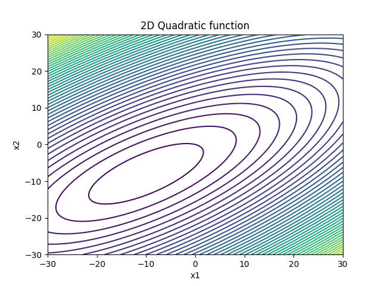
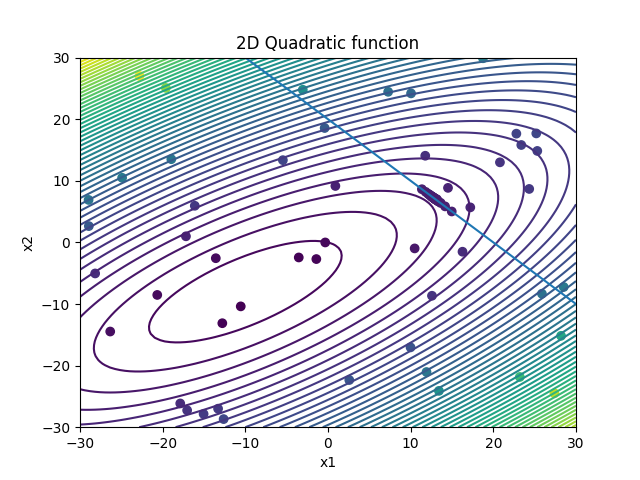

## Description

In this example, a 2D quadratic function is minimized with an external linear constraint. The optimization problem is given as

```math
\text{minimize  } f(x_1,x_2) = 0.5*x_1^2 + x_2^2 - x_1x_2 + 2x_1 + 6y_2
```
```math
\text{subject to  } x_1 + x_2 > 20, -30.0 \leq x_1 \leq 30.0  \text{ and } -30.0 \leq x_2 \leq 30.0.
```
The contour plot of the function is displayed below:



The function is implemented in the c-file "2DQuadratic.cpp". This small program reads the values of $x_1$ and $x_2$ from the file "dv.dat" and writes the output to 
the file "objFunVal.dat". 


## Running the test case

- To run the test case, run the python file "runOptimization.py" in terminal:

```
python runOptimization.py 
```


## Visualizing the results 

- To visualize the samples generated in the optimization process, run the python file "plotResults.py" in terminal:

```
python plotResults.py 
```



