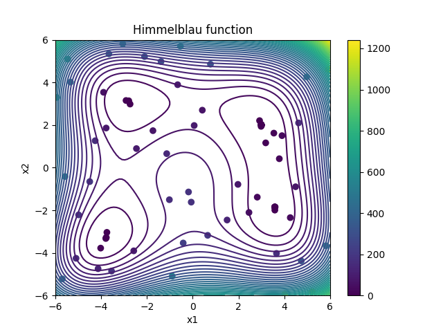

## Description

In this example, the Himmelblau test function is minimized without any external constraint. The optimization problem is given as

```math
\text{minimize  } f(x_1,x_2) = (x_1^2+x_2-11.0)^2 + (x_1+x_2^2-7.0)^2
```
```math
\text{subject to  }  -6.0 \leq x_1 \leq 6.0  \text{ and } -6.0 \leq x_2 \leq 6.0.
```
The optimization problem has four identical local solutions:

$f(3.0,2.0) = 0.0$

$f(-2.805118, 3.131312) = 0.0$

$f(-3.779319, -3.283186) = 0.0$

$f(3.584428, -1.848126) = 0.0$

The contour plot of the function is displayed below:


For this test case, we have also the adjoint Himmelblau function available. This adjoint version evaluates the function value as well as the gradient at a given input:
```math
f(x_1,x_2) = (x_1^2+x_2-11.0)^2 + (x_1+x_2^2-7.0)^2
```
and
```math
\nabla f(x_1,x_2) =  (\frac{\partial f}{\partial x_1} , \frac{\partial f}{\partial x_1} )^T  =  4x_1(x_1^2+x_2-11.0) + 2(x_1+x_2^2-7.0) , 2(x_1^2+x_2-11.0) + 2x_2(x_1+x_2^2-7.0))^T
```
By using the reverse mode of Algorithmic Differentiation one can easily generate the adjoint version of the Himmelblau function, which evaulates $f(x_1,x_2)$ and $\nabla f(x_1,x_2)$ simultaneously. 
The Himmelblau adjoint function is implemented in the c-file "himmelblau.cpp". This small program reads the values of $x_1$ and $x_2$ from the file "dv.dat" and writes the output to 
the file "objFunVal.dat". For this example, the output file consists of just three numbers: First the function value, then the derivatives of the function with respect to $x_1$ and $x_2$.


## Running the test case

- To run the test case, run the python file "runOptimization.py" in terminal:

```
python runOptimization.py 
```

## Visualizing the results 

- To visualize the samples generated in the optimization process, run the python file "plotResults.py" in terminal:

```
python plotResults.py 
```



