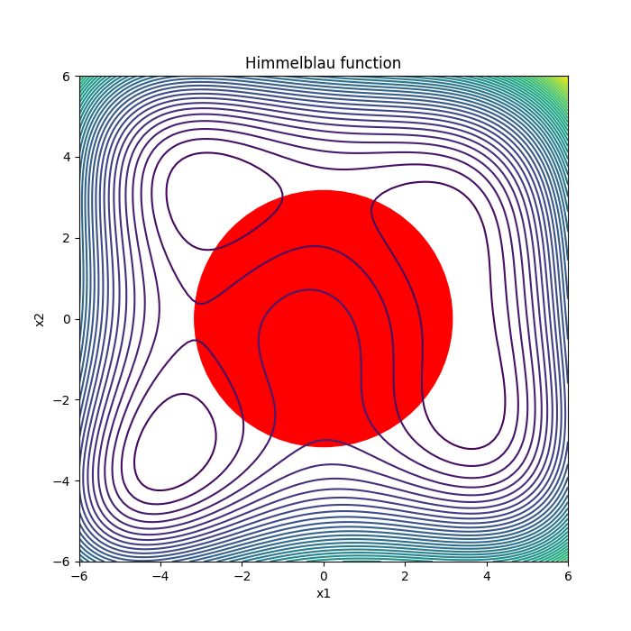
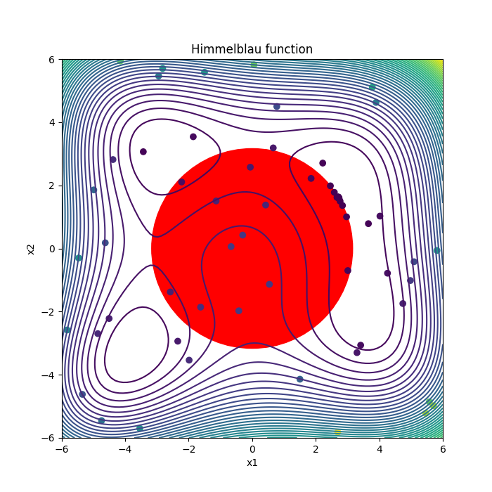

## Description

In this example, the Himmelblau test function is minimized with a non-linear external constraint. The optimization problem is given as

```math
\text{minimize  } f(x_1,x_2) = (x_1^2+x_2-11.0)^2 + (x_1+x_2^2-7.0)^2
```
```math
\text{subject to  }  x_1^2 + x_2^2 \leq 10.0,  -6.0 \leq x_1 \leq 6.0  \text{ and } -6.0 \leq x_2 \leq 6.0.
```

The contour plot of the function as well as the feasible region (red) are displayed below:



The constraint function $x_1^2 + x_2^2$ is implented in the c-file "constraint1.cpp". This small program reads the values of inputs $x_1$ and $x_2$ from the file "dv.dat" and writes the output to the file "constraintFunction1.dat". 
Similary the objective function is implemented in the c-file "himmelblau.cpp". This small program writes its output to the file "objFunVal.dat". 


## Running the test case

- To run the test case, run the python file "runOptimization.py" in terminal:

```
python runOptimization.py 
```

## Visualizing the results 

- To visualize the samples generated in the optimization process, run the python file "plotResults.py" in terminal:

```
python plotResults.py 
```



