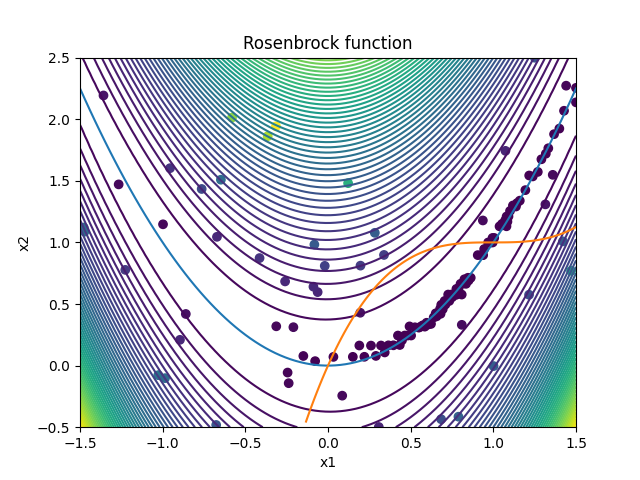

## Description

In this example, the 2D Rosenbrock function is minimized with two external non-linear constraints. The optimization problem is given as

```math
\text{minimize  } f(x_1,x_2) = (1-x_1)^2 + 100*(x_2-x_1^2)^2
```
```math
\text{subject to  } x_2 - x_1^2 > 0, (x_1-1)^3-x_2+1 > 0, -30.0 \leq x_1 \leq 30.0  \text{ and } -30.0 \leq x_2 \leq 30.0.
```
The contour plot of the function is displayed below:


The function is implemented in the c-file "Rosenbrock.cpp". This small program reads the values of $x_1$ and $x_2$ from the file "dv.dat" and writes the output to 
the file "objFunVal.dat".  


## Running the test case

- To run the test case, run the python file "runOptimization.py" in terminal:

```
python runOptimization.py 
```


## Visualizing the results 

- To visualize the samples generated in the optimization process, run the python file "plotResults.py" in terminal:

```
python plotResults.py 
```



